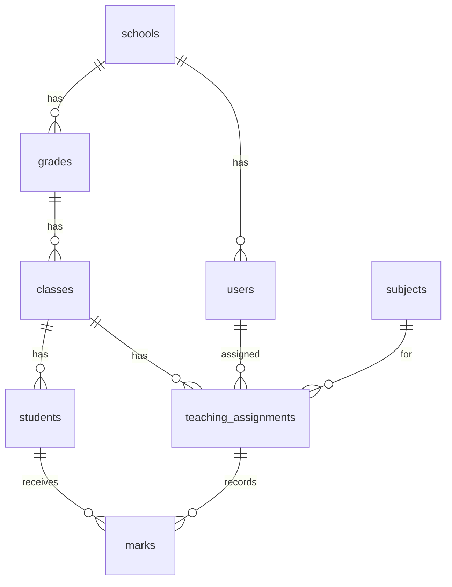
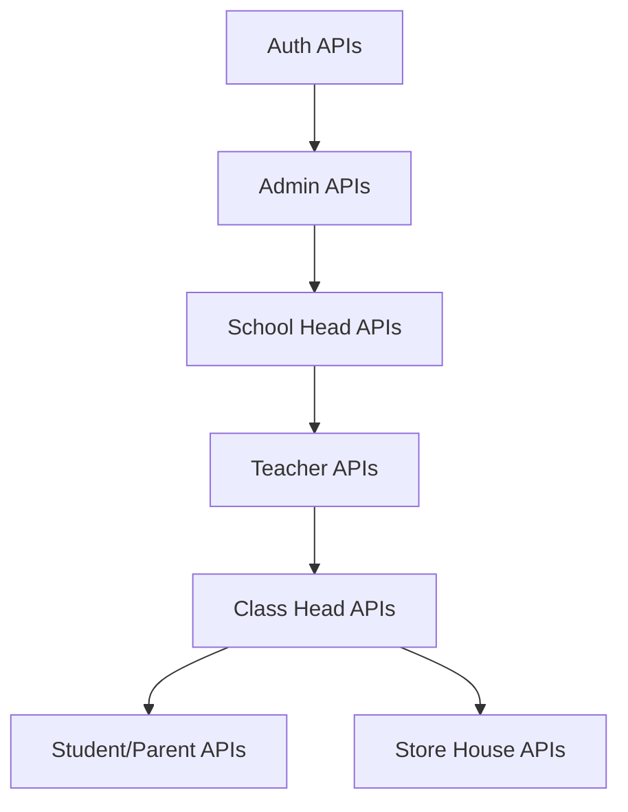

# School Portal Full Project Plan

## Project Overview

Build a grade management system for Ethiopian secondary schools (Grades 9-12) with 7 user roles: Admin, School Head, Teacher, Class Head, Student, Parent, Store House.

**Stack:** Node.js + Express + MySQL (Backend) | React.js (Frontend) + Tailwind CSS | Cloud Deployment

**Reference Files:**
- [API Contract](../API%20CONTRACT/apicontract.md) - Complete REST API specification
- Design mockups in [Design](../Design/) folder

---

## Task Checklist

| # | Task | Status |
|---|------|--------|
| 1 | Initialize backend with Express, folder structure, and dependencies | ✅ Complete |
| 2 | Initialize React frontend with Vite and folder structure | ✅ Complete |
| 3 | Design MySQL schema based on API contract entities | ⬜ Pending |
| 4 | Create SQL seed script with mock schools, users, classes, subjects | ⬜ Pending |
| 5 | Implement auth endpoints (login, me, logout) with JWT | ⬜ Pending |
| 6 | Implement Admin APIs (schools, promotion criteria, academic years) | ⬜ Pending |
| 7 | Implement School Head APIs (grades, classes, subjects, assignments) | ⬜ Pending |
| 8 | Implement Teacher APIs (grade entry, submit, assessment weights) | ⬜ Pending |
| 9 | Implement Class Head APIs (review, compile, publish, roster) | ⬜ Pending |
| 10 | Implement Student and Parent APIs (view reports) | ⬜ Pending |
| 11 | Implement Store House APIs (rosters, transcripts) | ⬜ Pending |
| 12 | Build login page and auth context | ⬜ Pending |
| 13 | Build Admin dashboard and pages | ⬜ Pending |
| 14 | Build School Head dashboard and pages | ⬜ Pending |
| 15 | Build Teacher dashboard with grade entry | ⬜ Pending |
| 16 | Build Class Head dashboard with compile/publish | ⬜ Pending |
| 17 | Build Student and Parent report views | ⬜ Pending |
| 18 | Build Store House roster and transcript pages | ⬜ Pending |
| 19 | Connect frontend to backend and test all flows | ⬜ Pending |
| 20 | Deploy backend and frontend to cloud | ⬜ Pending |

---

## Phase 1: Project Setup

### 1.1 Backend Setup

- Initialize Node.js project with Express
- Install dependencies: `express`, `mysql2`, `jsonwebtoken`, `bcryptjs`, `cors`, `dotenv`, `express-validator`
- Create folder structure:

```
backend/
  src/
    config/       # DB connection, JWT config
    controllers/  # Route handlers by role
    middleware/   # Auth, role-check, error handler
    models/       # Database queries
    routes/       # API routes by role
    utils/        # Helpers
  app.js
  server.js
```

### 1.2 Frontend Setup

- Create React app with Vite
- Install dependencies: `react-router-dom`, `axios`, `@tanstack/react-query`
- Create folder structure:

```
frontend/
  src/
    components/   # Reusable UI components
    pages/        # Pages by role
    services/     # API calls
    context/      # Auth context
    hooks/        # Custom hooks
    utils/        # Helpers
```

---

## Phase 2: Database Design

### 2.1 Entity Relationship Diagram



### 2.2 Key Tables

| Table | Description |
|-------|-------------|
| `schools` | School info + school_head reference |
| `users` | All user types with role field |
| `grades` | Grade levels (9, 10, 11, 12) |
| `classes` | Classes per grade (9A, 9B) |
| `subjects` | Subject names |
| `students` | Student bio data |
| `teaching_assignments` | Teacher-class-subject mapping |
| `assessment_types` | Test, quiz, project, etc. |
| `assessment_weights` | Weight % per assessment type |
| `marks` | Individual student scores |
| `grade_submissions` | Teacher submission status |
| `rosters` | Store house records |
| `transcripts` | Generated transcripts |

### 2.3 Seed Mock Data

- 2-3 schools
- Admin, School Heads, Teachers, Class Heads
- Students with parent links
- Store House users
- Sample classes, subjects, marks

---

## Phase 3: Backend Development

### 3.1 Authentication Module

- `POST /api/v1/auth/login` - Validate mock user, return JWT
- `GET /api/v1/auth/me` - Return current user from token
- `POST /api/v1/auth/logout` - Confirm logout
- JWT middleware to protect routes
- Role middleware to check permissions

### 3.2 API Implementation Order (by dependency)



**Priority Order:**

1. Auth (login, me, logout)
2. Admin (schools, promotion criteria, academic years)
3. School Head (grades, classes, subjects, assessments, assignments)
4. Teacher (assigned classes, grade entry, submit)
5. Class Head (review, compile, publish, roster)
6. Student + Parent (view reports)
7. Store House (rosters, transcripts)

---

## Phase 4: Frontend Development

### 4.1 Shared Components

- Login page
- Dashboard layout (sidebar, header)
- Tables with pagination
- Forms with validation
- PDF export component
- Loading/error states

### 4.2 Role-Based Pages

| Role | Key Pages |
|------|-----------|
| Admin | Schools list/create, Promotion criteria, Academic years, Statistics |
| School Head | Grades, Classes, Subjects, Assessment types, Teacher assignments, Reports |
| Teacher | My classes, Grade entry sheet, Submit grades, Assessment weights |
| Class Head | Student list, Submission checklist, Class snapshot, Compile/Publish, Roster |
| Student | Dashboard, Semester report, Year report, Subject details, Download PDF |
| Parent | Children list, Child reports, Download PDF |
| Store House | Rosters, Results, Cumulative records, Transcripts |

### 4.3 Routing Structure

| Route | Description |
|-------|-------------|
| `/login` | Public login page |
| `/admin/*` | Admin routes |
| `/school/*` | School Head routes |
| `/teacher/*` | Teacher routes |
| `/class-head/*` | Class Head routes |
| `/student/*` | Student routes |
| `/parent/*` | Parent routes |
| `/store-house/*` | Store House routes |

---

## Phase 5: Integration and Testing

### 5.1 API Integration

- Connect frontend to backend via axios
- Handle JWT storage (localStorage)
- Auto-redirect on 401
- Role-based route guards

### 5.2 Testing

- Test each API with Postman
- Test role permissions
- Test grade calculation flow: Teacher → Class Head → Student/Parent
- Test roster flow: Class Head → Store House

---

## Phase 6: Deployment

### 6.1 Backend Deployment (Railway or Render)

- Set up MySQL database (PlanetScale or Railway MySQL)
- Configure environment variables
- Deploy Express app

### 6.2 Frontend Deployment (Vercel or Netlify)

- Build React app
- Configure API URL for production
- Deploy

### 6.3 Final Checklist

- [ ] CORS configured for frontend domain
- [ ] Environment variables secured
- [ ] Database seeded with demo data
- [ ] All roles can login and perform actions

---

## Recommended Timeline (Working Alone)

| Phase | Duration | Focus |
|-------|----------|-------|
| Phase 1 | 2-3 days | Setup both projects |
| Phase 2 | 2-3 days | Database + seed data |
| Phase 3 | 7-10 days | All backend APIs |
| Phase 4 | 10-14 days | All frontend pages |
| Phase 5 | 3-4 days | Integration + testing |
| Phase 6 | 2-3 days | Deployment |

**Total: ~4-5 weeks**

---

## Next Immediate Steps

1. Create `backend/` folder with Express project
2. Create `frontend/` folder with React + Vite
3. Design MySQL schema based on API contract
4. Implement auth endpoints first
5. Build login page and test the flow

